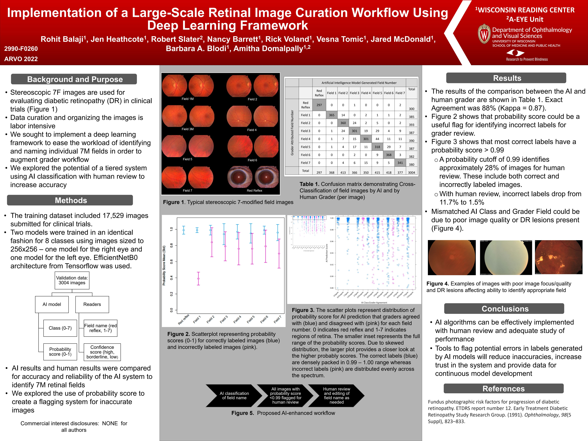

# UW-Presentations
Models built at UW-Madison

## Strong v Weak Labeling--the first A-EYE paper!
Our first major publication for the A-Eye unit.  I had the initial concept of doing regression to predict area given we had the areas and not the segmentation.  Our group (not me) produced detailed segmentation of Geographic Atrophy on Fundus Autoflouresence, and I then developed a segmentation model. I built and trained both types of models (pretrained + fine tuning). The figures were generated from my code and most of the statistical analysis was done by myself (reviewed by our statistician). The "Strong" model was later deployed via a Python App (developed by me) and the results of that clinical trial are described in another presentation.
Our director wrote the paper proper.  The models and research were developed by me independently.
[Published Paper](Strong%20v%20Weak%20Labeling.pdf)

## OCT 3D (kinda!) Segmentation Model
.
I built a model for segmenting 3D volumes known as OCT (Optical Coherence Tomography).  This is 3D scan of the eye and shows the different layers of the eye.  One of the most important is the RPE layer.  Damage to this layer causes vision loss.  We had several hundred labeled OCTs and what we really want is an "En Face" map or a top down view of the volume showing where the RPE layer is missing.  To do this I treated the X and Z dimensions and the height and width of a color picture and the Y dimension (looking down) as a color channel which allowed the 2D convolutions to "scan" a column of pixels.  The reason is humans look for "waterfall" effects in the OCT slices where there are bright streaks in the Y dimension.  This presentation was after I acheived an excellent dice score on the test set, and the results were reviewed by human graders to understand where the model was failing.  The "flipping" of a 3D volume and using a 2D Unet was my idea as we had limited GPU capacity and 3d Segmentation is computationally EXPENSIVE.  This works on a laptop!  I did 100% of the model development and deployment for this project.

## ARVO2023Poster_FINAL_v.pptx

I did all of the model training and anlysis for this model.   I used a CNN to predict the area of a lesion without actually segmenting it (Nominally called "weak labels").  This was done as the reading center had area data but had lost the segmentation files.  I used EffcientNet (pretrain + fine tuned) to train this.  The short version of this is as you get more and more samples the final result improves.  Actually working in reverse as you shrink your data size, the model tends to perform worse AND more variable.

## 16 Class Classifier for Retina Photos

This was a model I built around 2022 to classify which field a given photo was from. It Retina Photography the 7 field is standard to capture all of the eye. Often we get zip files and it is not immedately obvious which photo is which field. In addition both the left and right eyes can be contained in a volume and also includes a zoomed out image called the "Red Reflex". Thus this is a 16 class classifier that predicts both the laterality and which of the seven fields (or reflex) the image belongs too. Accuracy was 88%. But I also found that if the prediction had low confidence (below 99%) it was likely an error and could be thrown back for human review. This was a HUGE speedup in labeling this data.

## RobertSlaterARVO2022Poster.pdf

This was an early autoencoder attempt to try and reduce blur for retina images.  One of my first projects after being in NLP for some time (predates diffusion and ViT)  The goal of this was to improve image quality for poor quality images that used a local software to identify arteries and veins in the retina.  I did 100% of model development and training.

## Robert_GA-precursors_ARVO2025_Final.pdf

This was our first multimodal attempt at a model.  I did the high level architecture and design while the 2nd Author (Postdoc) did the actual training under my guidance.  We tried to use Grad-Cam maps and secondary infor to improve our prediction of Geographic Atrophy--an uncurable eye disease, so predicting progression is VERY important.  Rather sadly it turned out the image-only model was better performing than the multimodal.

