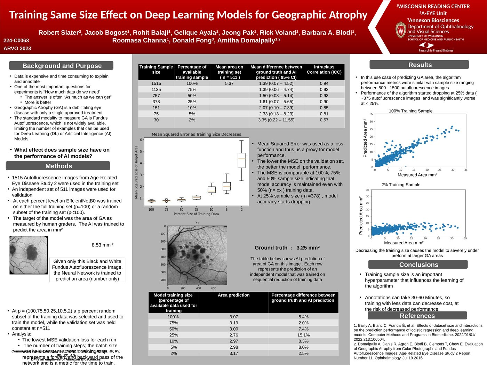
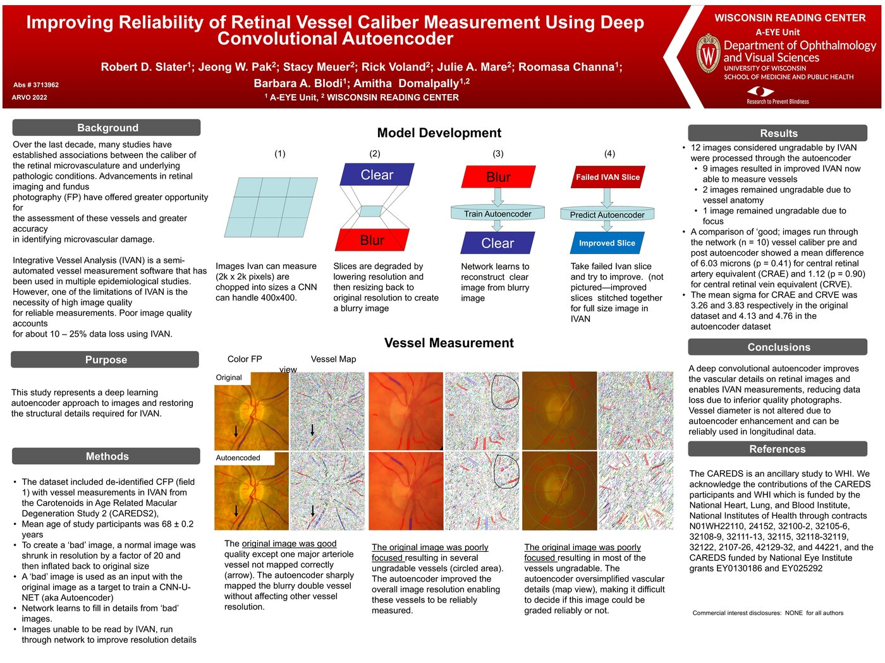
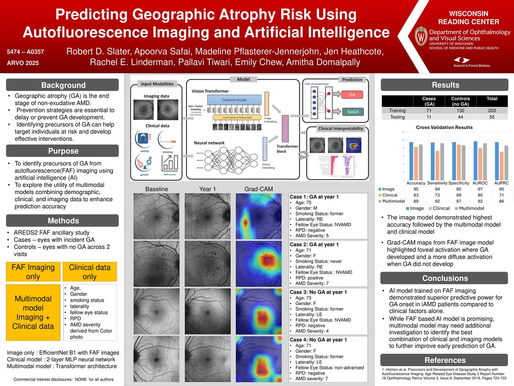

# UW-Presentations
Models built at UW-Madison

## Strong v Weak Labeling--the first A-EYE paper!
Our first major publication for the A-Eye unit.  I had the initial concept of doing regression to predict area given we had the areas and not the segmentation.  Our group (not me) produced detailed segmentation of Geographic Atrophy on Fundus Autoflouresence, and I then developed a segmentation model. I built and trained both types of models (pretrained + fine tuning). The figures were generated from my code and most of the statistical analysis was done by myself (reviewed by our statistician). The "Strong" model was later deployed via a Python App (developed by me) and the results of that clinical trial are described in another presentation.
Our director wrote the paper proper.  The models and research were developed by me independantly.
[Published Paper](Strong\ v\ Weak\ Labeling.pdf)

## ARVO2023Poster_FINAL_v.pptx

I did all of the model training and anlysis for this model.   I used a CNN to predict the area of a lesion without actually segmenting it (Nominally called "weak labels").  This was done as the reading center had area data but had lost the segmentation files.  I used EffcientNet (pretrain + fine tuned) to train this.  The short version of this is as you get more and more samples the final result improves.  Actually working in reverse as you shrink your data size, the model tends to perform worse AND more variable.

## RobertSlaterARVO2022Poster.pdf

This was an early autoencoder attempt to try and reduce blur for retina images.  One of my first projects after being in NLP for some time (predates diffusion and ViT)  The goal of this was to improve image quality for poor quality images that used a local software to identify arteries and veins in the retina.  I did 100% of model development and training.

## Robert_GA-precursors_ARVO2025_Final.pdf

This was our first multimodal attempt at a model.  I did the high level architecture and design while the 2nd Author (Postdoc) did the actual training under my guidance.  We tried to use Grad-Cam maps and secondary infor to improve our prediction of Geographic Atrophy--an uncurable eye disease, so predicting progression is VERY important.  Rather sadly it turned out the image-only model was better performing than the multimodal.

